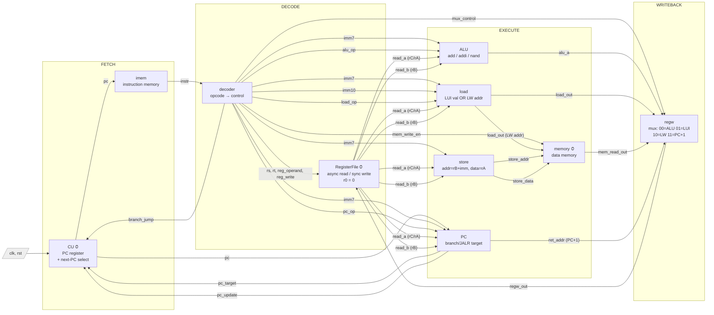

# JPU Datapath — RiSC-16 Single-Cycle CPU

Block diagram of the whole CPU, derived directly from the module
instances and wires in [`jpu.v`](jpu.v). `jpu.v` contains no logic of its
own — every box below is an instantiated module, every arrow is a wire.

Sequential (clocked) state lives in exactly **three** places, marked with a
clock symbol: the PC register (`CU`), the register file write
(`RegisterFile`), and the data-memory write (`memory`). Everything else is
combinational and settles within one cycle.

---

## Mermaid (renders in VS Code / GitHub)



---

## ASCII (terminal-friendly)

```
        +---------+        +----------+        +-----------+
 clk -->|  CU  ⏱  |  pc -->|   imem   |instr-->|  decoder  |
 rst -->| PC reg  |        | instr mem|        | opcode -> |
        +----+----+        +----------+        |  control  |
          ^  |  ^                              +-----+-----+
          |  |  |  pc                                |  control signals
   branch_|  |  +------------------------------+     | (alu_op, imm7/10,
   jump   |  |                                 |     |  load_op, pc_op,
   pc_upd |  | pc                              |     |  mem_write_en,
   pc_tgt |  v                                 v     |  mux_control,
        +-+--------+                      +----------v--+ reg_write...)
        |    PC    |<--- read_a, read_b --| RegisterFile|<-+
        | br/JALR  |   pc                 |   ⏱  r0=0   |  | regw_out
        |  target  |                      +--+-------+--+  | (write-back)
        +----------+                  read_a |       | read_b
           | ret_addr (PC+1)                 v       v
           |                    +-------+ +-------+ +-------+ +-------+
           |                    |  ALU  | | load  | | store | |  PC   |
           |                    | a=b+c | |LUI val| |addr=  | |(above)|
           |                    | b+imm | |  or   | | rB+imm| +-------+
           |                    | nand  | |LW addr| |data=rA|
           |                    +---+---+ +---+---+ +---+---+
           |                  alu_a |  load_out |  addr/data|
           |                        |     |     |     |     |
           |                        |     |     v     v     v
           |                        |     |   +-----------------+
           |                        |     +-->|    memory  ⏱    |
           |                        |  (LW    |   data memory   |
           |                        |  addr)  +--------+--------+
           |                        |                  | mem_read_out
           |                        v                  v
           |   ret_addr     +-------------------------------+
           +--------------->|             regw              |
                            | mux: 00=ALU 01=LUI 10=LW 11=PC+1
                            +---------------+---------------+
                                            | regw_out
                                            +--> RegisterFile (write-back)
```

---

## Dataflow summary

1. **Fetch:** `CU` holds the PC and presents it to `imem`, which returns the
   16-bit `instr`.
2. **Decode:** `decoder` splits `instr` into register selectors and control
   signals; `RegisterFile` reads `read_a` / `read_b` combinationally.
3. **Execute:** the operands fan out to four units in parallel — `ALU`,
   `load`, `store`, `PC`. Only the unit selected by the current instruction's
   control signals produces a meaningful result.
4. **Memory:** `memory` reads (LW, async) or writes (SW, sync on clock edge).
5. **Write-back:** `regw` selects one of {ALU result, LUI value, LW data,
   PC+1} via `mux_control` and drives it back into `RegisterFile`.
6. **Next PC:** `PC` computes the branch/JALR target and `pc_update`; `CU`
   uses these (plus `branch_jump`) to choose PC+1 vs. the target on the next
   clock edge.

All of this happens in a **single clock cycle** per instruction.
```
